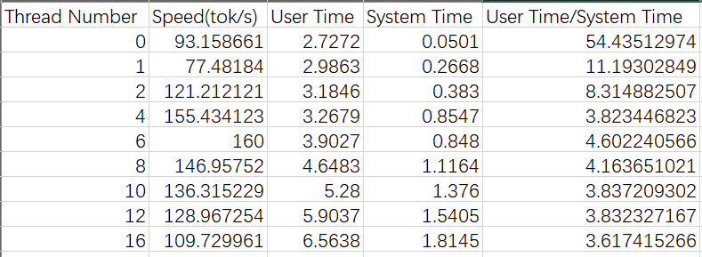

# Report
Xu Ziyin 3036173372

- When the number of threads increases (0->4), the threads execute at the same time, so the performance(User Time/System Time) is better.
- But the number of CPU is limited, which means the number of threads executing synchronously is limited. As a result, if the number of threads continues increasing, context switches cost a lot of extra time, and the performance may be worse.